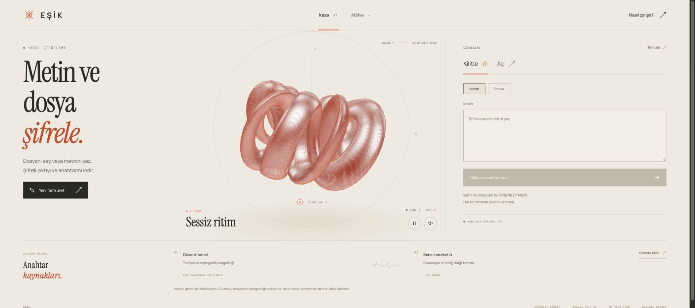

# EŞİK

Tarayıcıda metin ve dosya şifreleme; tohumdan üretilen interaktif 3D formlar.

[Uygulamayı aç](https://makeme.parzi.dev/)



## Kullanım

- **Kasa:** Metin veya en fazla 10 MiB dosya seç, şifrele, `.jwe` çıktısını ve açma anahtarını ayrı indir. Aç sekmesinde ikisini kullanarak içeriği geri al.
- **Atölye:** Yeni form üret, bakır/porselen/grafit malzeme seç, hareketi ve isteğe bağlı sesi ayarla, PNG afiş indir.
- Heykeli sürükleyerek döndür; basılı tutarak katmanlarını aç. `N` yeni form üretir, boşluk hareketi durdurur. Metin alanlarında bu kısayollar çalışmaz.

Anahtar kaybolursa içerik geri alınamaz. Şifreleme, şifre çözme ve isteğe bağlı kamera örnekleme tarayıcı içinde çalışır. Uygulama içeriği veya anahtarı sunucuya yüklemez; kalıcı tarayıcı depolaması kullanmaz. Sayfa kapatıldığında indirilmeyen sonuçlar kaybolur.

## Yerel çalıştırma

Node.js 22.12 veya üzeri ve npm gerekir.

```bash
npm ci
npm run dev
```

Vite'nin terminalde verdiği localhost adresini aç. Kamera ve Web Crypto için localhost veya HTTPS gerekir.

```bash
npm test
npm run build
npm run preview
```

Üretim dosyaları `dist/` klasörüne çıkar. Testlerde Node'un yerleşik test çalıştırıcısı kullanılır. Bağımsız AES-GCM uyumluluk testi, Python 3 ve `cryptography` varsa çalışır; yoksa yalnızca bu test atlanır.

## Şifreleme

`vault-crypto.js`, Web Crypto ile AES-256-GCM kullanır. Her işlemde yeni 256 bit anahtar, 96 bit IV ve 128 bit doğrulama etiketi üretilir. Dosya adı, içerik türü ve veri şifreli JSON yükünün içindedir.

Çıktı [JWE Compact Serialization](https://www.rfc-editor.org/rfc/rfc7516.html) biçimindedir (`alg: dir`, `enc: A256GCM`). Açma anahtarı `ESIK1-` öneki ve base64url kodlanmış 32 bayttan oluşur; parola değildir. Yanlış anahtar veya değiştirilmiş veri reddedilir.

[Cloudflare LavaRand](https://blog.cloudflare.com/lavarand-in-production-the-nitty-gritty-technical-details/) fikrinden esinlenen isteğe bağlı hareket/kamera örnekleri SHA-256 havuzuna girer ve HKDF-SHA-256 ile yeni kriptografik anahtara karıştırılır. Kamera başlangıçta kapalıdır; ses kaydı alınmaz. Ek örnekler için ölçülmüş entropi veya güvenlik artışı iddia edilmez. Güvenli temel her zaman tarayıcının kriptografik rastgeleliğidir.

3D heykel bir görselleştirmedir. Paylaşılabilir 128 bit form tohumu deterministiktir ve şifreleme anahtarından ayrıdır. Bu prototip bağımsız güvenlik denetiminden geçmemiştir; JavaScript belleğindeki tüm kopyaların güvenli biçimde silinmesi garanti edilemez.

## Dosyalar

| Dosya | İşlev |
| --- | --- |
| `main.js` | Three.js sahnesi, etkileşim, Web Audio ve PNG afiş |
| `form-generator.js` | Tohumdan deterministik geometri, ad ve akor üretimi |
| `vault-crypto.js` | JWE şifreleme ve şifre çözme |
| `vault-sources.js` | Hareket örnekleri, yerel kamera örnekleme ve kaynak havuzu |
| `vault-ui.js` | Kasa, indirme ve çalışma alanı kontrolleri |
| `style.css`, `vault.css` | Masaüstü ve mobil arayüz |
| `test/` | Geometri, şifreleme ve kaynak yaşam döngüsü testleri |

## Docker

```bash
npm ci
npm run build
docker network inspect nginx-proxy-manager
docker compose up -d
```

`compose.yaml`, mevcut `nginx-proxy-manager` harici ağına bağlanır ve Docker ağı içinde `5000` portundan statik dosyaları sunar. Ağ yoksa oluştur veya kendi proxy ağına göre Compose dosyasını düzenle. Proxy hedefi `makeme:5000` olabilir; mevcut kurulumla uyum için `makmeme` alias'ı da korunur. Container host portu yayınlamaz. Sağlık kontrolü `/healthz` adresidir.

`nginx.conf`, uygulamanın API bağlantılarını ve form gönderimini kapatan CSP ile kamera dışındaki cihaz izinlerini sınırlar. Bu başlıklar Vite geliştirme sunucusunda uygulanmaz. Web sunucusu veya önündeki proxy normal HTTP erişim kayıtları tutabilir.

## Fontlar

Manrope, Instrument Serif ve IBM Plex Mono yerel sunulur. Telif bildirimleri, kaynakları ve SIL Open Font License metinleri [public/fonts/README.md](public/fonts/README.md) içinde belirtilmiştir.
