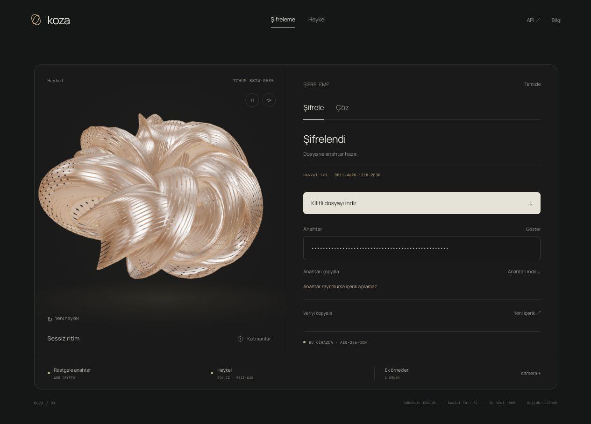

# Koza

Tarayıcıda metin ve dosya şifreleme; aynı kriptografik modülü kullanan erişim kontrollü backend API.

[Uygulamayı aç](https://makeme.parzi.dev/)



## Kullanım

- **Şifreleme:** Metin veya en fazla 10 MiB dosya seç, şifrele, `.jwe` çıktısını ve açma anahtarını ayrı indir. Aç sekmesinde ikisini kullanarak içeriği geri al.
- **Heykel:** Yeni form üret, bakır/porselen/grafit malzeme seç, hareketi ve isteğe bağlı sesi ayarla, PNG görsel indir.
- Heykeli sürükleyerek döndür; basılı tutarak katmanlarını aç. `N` yeni form üretir, boşluk hareketi durdurur. Metin alanlarında bu kısayollar çalışmaz.

Anahtar kaybolursa içerik geri alınamaz. Şifreleme, şifre çözme ve isteğe bağlı kamera örnekleme tarayıcı içinde çalışır. Tarayıcı uygulaması içeriği veya anahtarı sunucuya yüklemez; kalıcı tarayıcı depolaması kullanmaz. Sayfa kapatıldığında indirilmeyen sonuçlar kaybolur.

## Yerel çalıştırma

Node.js 22.12 veya üzeri ve npm gerekir.

```bash
npm ci
npm run dev
```

Vite'nin terminalde verdiği localhost adresini aç. Kamera ve Web Crypto için localhost veya HTTPS gerekir.

```bash
npm test
npm run build
npm run preview
```

Üretim dosyaları `dist/` klasörüne çıkar. Testlerde Node'un yerleşik test çalıştırıcısı kullanılır. Bağımsız AES-GCM uyumluluk testi, Python 3 ve `cryptography` varsa çalışır; yoksa yalnızca bu test atlanır.

## Şifreleme

`vault-crypto.js`, Web Crypto ile AES-256-GCM kullanır. Her işlemde yeni 256 bit anahtar, 96 bit IV ve 128 bit doğrulama etiketi üretilir. Dosya adı, içerik türü ve veri şifreli JSON yükünün içindedir.

Çıktı [JWE Compact Serialization](https://www.rfc-editor.org/rfc/rfc7516.html) biçimindedir (`alg: dir`, `enc: A256GCM`). Açma anahtarı `KOZA1-` öneki ve base64url kodlanmış 32 bayttan oluşur; parola değildir. Yanlış anahtar veya değiştirilmiş veri reddedilir.

[Cloudflare LavaRand](https://blog.cloudflare.com/lavarand-in-production-the-nitty-gritty-technical-details/) fikrinden esinlenen isteğe bağlı hareket/kamera örnekleri SHA-256 havuzuna girer ve HKDF-SHA-256 ile yeni kriptografik anahtara karıştırılır. Kamera başlangıçta kapalıdır; ses kaydı alınmaz. Ek örnekler için ölçülmüş entropi veya güvenlik artışı iddia edilmez. Güvenli temel her zaman tarayıcının kriptografik rastgeleliğidir.

**Heykel anahtara dahildir.** Her kilitlemede gerçek WebGL karesinin 64×64 piksel örneği ve o karede kullanılan biçim, materyal, zaman, katman açıklığı, geçiş ve dönüşüm durumu SHA-256 ile özetlenir. HKDF-SHA-256 `info` alanına bu özet ve sürümlü uygulama bağlamı girer; girdi anahtarı her seferinde Web Crypto ile yeniden üretilir. Ek örnek havuzu varsa `salt`, yoksa sıfır dolu 32 bayt salt kullanılır. [Web Crypto standardı](https://www.w3.org/TR/2017/REC-WebCryptoAPI-20170126/#hkdf-operations) kullanılır. Heykel okunamazsa şifreleme bir hata gösterir.

Heykelin SHA-256 izi şifreli JSON yükünde saklanır ve AES-GCM ile doğrulanır; sonuçta ve şifre çözülünce kısa izi gösterilir. Açmak için heykeli yeniden üretmek gerekmez: indirilen anahtar yeterlidir. Önceki `.jwe` dosyaları ve `ESIK1-` anahtarları desteklenir. Yeni anahtarlar `KOZA1-` öneki taşır; JWE biçimi değişmez.

Paylaşılabilir 128 bit form tohumu deterministiktir; heykel tek başına anahtarı yeniden oluşturamaz. Heykel katkısı için ölçülmüş entropi veya ek güvenlik iddiası yoktur. Bu prototip bağımsız güvenlik denetiminden geçmemiştir; JavaScript belleğindeki tüm kopyaların güvenli biçimde silinmesi garanti edilemez.

## Dosyalar

| Dosya | İşlev |
| --- | --- |
| `main.js` | Three.js sahnesi, etkileşim, Web Audio ve PNG görsel |
| `form-generator.js` | Tohumdan deterministik geometri, ad ve akor üretimi |
| `vault-crypto.js` | JWE şifreleme ve şifre çözme |
| `vault-sources.js` | Heykel karesi özeti, hareket örnekleri, yerel kamera ve kaynak havuzu |
| `vault-ui.js` | Kasa, indirme ve çalışma alanı kontrolleri |
| `koza.css` | Masaüstü ve mobil arayüz |
| `test/` | Geometri, şifreleme ve kaynak yaşam döngüsü testleri |

## Docker

```bash
npm ci
npm run build
docker network inspect nginx-proxy-manager
mkdir -p .secrets
chmod 700 .secrets
openssl rand -hex 32 > .secrets/api-token
chmod 444 .secrets/api-token
docker compose up -d
```

`compose.yaml`, mevcut `nginx-proxy-manager` harici ağına bağlanır ve Docker ağı içinde `5000` portundan statik dosyaları sunar. Ağ yoksa oluştur veya kendi proxy ağına göre Compose dosyasını düzenle. Proxy hedefi `makeme:5000` olabilir; mevcut kurulumla uyum için `makmeme` alias'ı da korunur. Container host portu yayınlamaz. Sağlık kontrolü `/healthz` adresidir.

`nginx.conf`, uygulamanın API bağlantılarını ve form gönderimini kapatan CSP ile kamera dışındaki cihaz izinlerini sınırlar. Bu başlıklar Vite geliştirme sunucusunda uygulanmaz. Web sunucusu veya önündeki proxy normal HTTP erişim kayıtları tutabilir.

## Fontlar

Manrope, Instrument Serif ve IBM Plex Mono yerel sunulur. Telif bildirimleri, kaynakları ve SIL Open Font License metinleri [public/fonts/README.md](public/fonts/README.md) içinde belirtilmiştir.

## Backend API

[API belgesi](https://makeme.parzi.dev/api) · [OpenAPI 3.1](https://makeme.parzi.dev/api/v1/openapi.json)

API Node.js’in yerleşik HTTP sunucusu ve [Web Crypto](https://nodejs.org/api/webcrypto.html) ile çalışır; ek sunucu bağımlılığı yoktur. `backend/server.js`, tarayıcıdaki `vault-crypto.js` modülünü doğrudan kullanır. Bu bir AES-256-GCM/JWE servisidir; yeni bir kriptografik algoritma değildir.

```bash
export KOZA_API_TOKEN="$(openssl rand -hex 32)"
npm run api
```

Yerelde `http://127.0.0.1:3000` dinler. `HOST`, `PORT`, `KOZA_API_TOKEN` veya `KOZA_API_TOKEN_FILE` ile yapılandırılır. Erişim anahtarı eksik/kısaysa servis başlamaz. Docker'da token `.secrets/api-token` dosyasından read-only secret olarak okunur; image'e veya frontend'e gömülmez. Mevcut token dosyasını tekrar üretmek erişim anahtarını değiştirir. `.secrets/` Git tarafından hariç tutulur.

- `POST /api/v1/encrypt`: `{ "text": "Merhaba", "name": "not.txt" }` veya `{ "data": "AAEC_w", "name": "dosya.bin", "mime": "application/octet-stream" }`. `text` ve `data` aynı anda gönderilemez. Çıktı `{jwe, key, algorithm}`.
- İsteğe bağlı `sculpture`: 64 karakterlik heykel SHA-256 izi. HKDF `info` alanına katılır; yanıtta ve şifreli yükte yer alır. Backend render işlemi yapmaz. Alan yoksa taze rastgele AES anahtarı kullanılır. Girdi anahtarı ve IV her durumda yeniden üretilir.
- `POST /api/v1/decrypt`: `{ "jwe": "…", "key": "KOZA1-…" }`. Yanıt `{kind,name,mime,text}` veya `{kind,name,mime,data}` ve varsa `sculpture`. Eski dosyalar da açılır.
- İşlem uçlarında `Authorization: Bearer <erişim-anahtarı>` ve `Content-Type: application/json` gerekir. `GET /api/v1/openapi.json` ve dahili `/healthz` açıktır. CORS izni verilmez; backend uygulamaları HTTPS üzerinden çağırabilir.
- 10 MiB içerik sınırı, JSON gövde sınırı, 30 saniye istek zaman aşımı, servis başına 60 işlem/dakika ve 2 eşzamanlı işlem sınırı uygulanır. Hata yanıtları veri veya anahtar içermez.
- İçerik ve anahtar **API kullanımında sunucuda işlenir**. Disk/veritabanı kaydı ve istek gövdesi logu yoktur; cevaplar `Cache-Control: no-store` taşır. Nginx API proxy'sinde istek/yanıt buffering ve access log kapalıdır. Tarayıcı uygulaması bu servisi çağırmaz ve yerel kalır. JavaScript belleğindeki tüm kopyaların silinmesi garanti edilmez.

HTTP servisi kullanmadan kendi Node backend'inde de aynı modül import edilebilir:

```js
import { webcrypto } from 'node:crypto';
import { seal, unseal } from './vault-crypto.js';
const result = await seal({
  kind: 'text', name: 'not.txt', mime: 'text/plain',
  bytes: new TextEncoder().encode('Merhaba'),
}, null, webcrypto);
const opened = await unseal(result.compact, result.secret, webcrypto);
```

API testleri erişim kontrolü, tarayıcı/servis uyumluluğu, eski anahtarlar, Unicode/binary round-trip, heykel bağlamı, bozulmuş veri, boyut ve hız sınırlarını doğrular.
